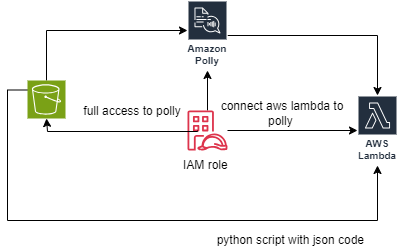

# AWSProject1
Neat diagram of project architechture of the project 

Overview
This project demonstrates the integration of AWS Polly, a service that converts text into lifelike speech. The project is designed to [create audio versions of textual content].

Features
Text-to-Speech Conversion: Converts input text files to audio using AWS Polly.
S3 Integration: Stores input text files and output audio files in AWS S3.
Automated Workflow: AWS Lambda automates the process upon file upload.
Multiple Voice Options: Supports various voices and languages.

